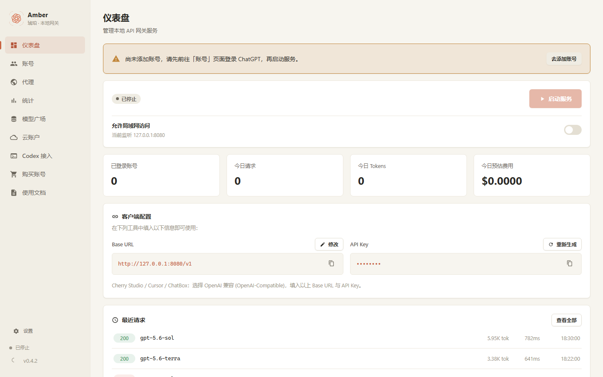
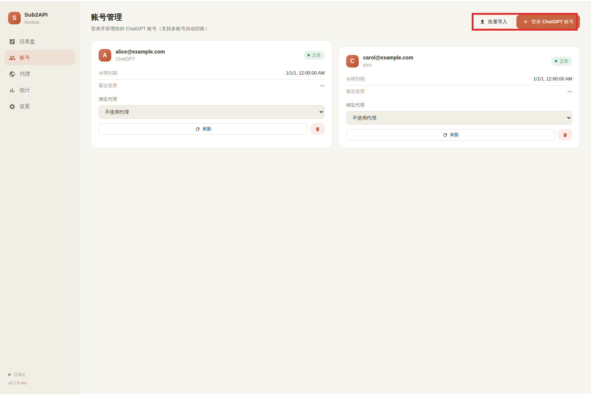
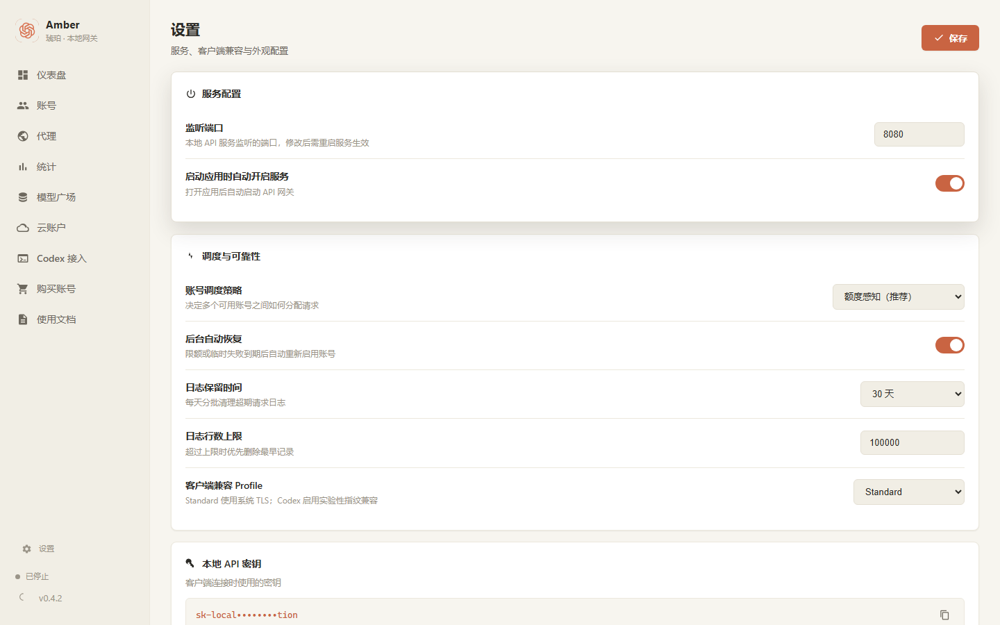
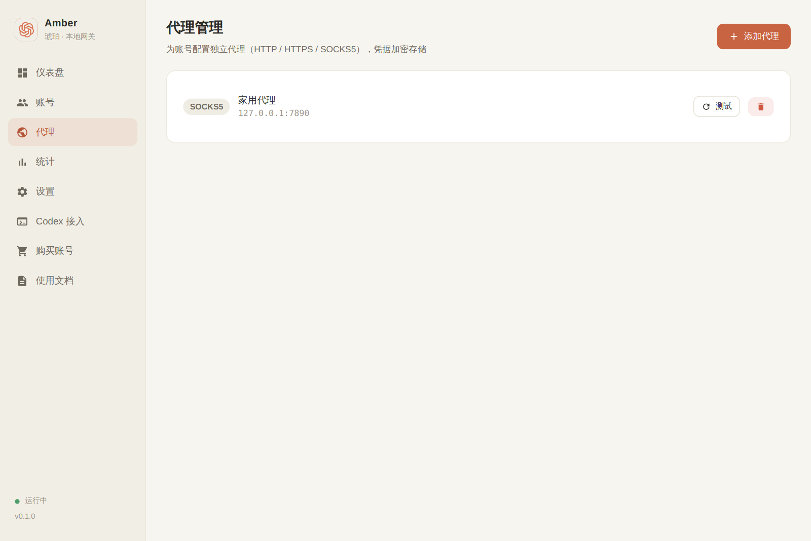
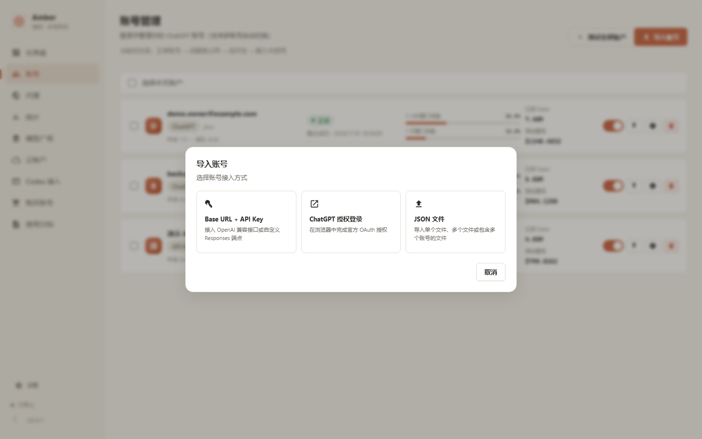

<div align="center">


# Amber · 琥珀

**把你的 ChatGPT 订阅变成本地 OpenAI 兼容 API 的桌面网关**

Tauri v2 · Vue 3 · Go

[下载安装](#下载安装) · [使用教程](docs/USAGE.md) · [从源码构建](#从源码构建) · [常见问题](#常见问题)

</div>

---

## 简介

Amber（琥珀）是一个 Windows 桌面应用，将 ChatGPT 订阅账号转换为本地 OpenAI 兼容 API（`http://127.0.0.1:8080/v1`），让 Cherry Studio、Cursor、ChatBox、Codex CLI 等工具像调用 OpenAI API 一样直接使用。所有数据只保存在本机，令牌加密存储。核心网关逻辑基于开源项目 [sub2api](https://github.com/search?q=sub2api)（LGPL v3）改造，仅限个人使用。

## 界面预览

| 仪表盘 | 账号管理 |
|---|---|
|  |  |

| 统计 | 设置 |
|---|---|
|  |  |

| 代理管理 | 批量导入 |
|---|---|
|  |  |

## 功能

- **仪表盘**：网关运行状态、请求统计一览，一键复制 Base URL / API 密钥
- **账号管理**：OAuth 登录或批量导入 ChatGPT 账号，自动故障切换
- **代理管理**：为账号配置上游代理（HTTP / HTTPS / SOCKS5）并测试连通性
- **统计**：请求量、成功率、Token 用量、延迟趋势与请求日志
- **Codex 接入**：一键生成 Codex CLI 远程配置，可直接复制
- **反封号**：Codex 指令注入、TLS 指纹伪装
- **设置**：API 端口、密钥管理、加密存储、中英双语

## 下载安装

从 [Releases 页面](../../releases) 下载最新版本：

- **`Amber_x.y.z_x64-setup.exe`** — NSIS 安装包（推荐）
- **`Amber_x.y.z_x64_en-US.msi`** — MSI 安装包

系统要求：Windows 10 及以上（需要 WebView2 运行时，Win11 自带；缺失时安装器会自动引导安装）。

安装后请阅读 **[使用教程](docs/USAGE.md)**（与软件内「使用文档」页面一致），从添加账号到客户端接入的完整图文指引。

## 快速上手

1. 打开「账号」页面，OAuth 登录或批量导入 ChatGPT 账号
2. （可选）在「代理」页面添加代理并绑定到账号
3. 回到「仪表盘」点击「启动服务」
4. 在客户端（Cherry Studio / Cursor / ChatBox 等）选择「OpenAI 兼容」，Base URL 填 `http://127.0.0.1:8080/v1`，API Key 填仪表盘上的本地密钥

详细步骤（含批量导入 JSON 格式、SSH 远程隧道接入等）见 [docs/USAGE.md](docs/USAGE.md)。

## 技术架构

```
┌────────────────────────────────────────┐
│           Tauri v2 桌面应用             │
│  ┌──────────────┐   ┌───────────────┐  │
│  │ Vue 3 前端    │──▶│  Rust 壳       │  │
│  │ (Vite + TS)  │   │  (窗口/托盘)    │  │
│  └──────────────┘   └──────┬────────┘  │
│                            │ 启动/守护   │
│                     ┌──────▼────────┐  │
│                     │  Go Sidecar   │  │
│                     │  本地网关核心   │  │
│                     └──────┬────────┘  │
└────────────────────────────┼───────────┘
                             ▼
              http://127.0.0.1:<端口>/v1/...
              （OpenAI 兼容 API，本地调用）
```

- `src/` — Vue 3 前端
- `src-tauri/` — Rust 壳与打包配置
- `core/` — Go sidecar 源码（账号、代理、网关、存储、OAuth、Codex 配置等模块）
- `scripts/` — 构建脚本
- `docs/` — 使用教程

## 从源码构建

### 前置依赖

| 工具 | 版本 |
|---|---|
| Node.js | ≥ 18 |
| Rust（含 MSVC 工具链） | stable |
| Go | ≥ 1.21 |

### 一键构建

```powershell
npm install
.\scripts\build-all.ps1
```

脚本会先编译 Go sidecar，再执行 `npm run tauri build` 打出安装包。产物：

- 安装包（NSIS）：`src-tauri\target\release\bundle\nsis\Amber_x.y.z_x64-setup.exe`
- 安装包（MSI）：`src-tauri\target\release\bundle\msi\Amber_x.y.z_x64_en-US.msi`

### 分步构建

```powershell
# 1. 编译 Go sidecar（必须先做，二进制不入库）
.\scripts\build-sidecar.ps1

# 2. 安装前端依赖并打包
npm install
npm run tauri build
```

> sidecar 二进制不入库（见 `.gitignore`），克隆仓库后必须先编译 sidecar，否则打包报错 `resource path 'binaries\...' doesn't exist`。

### 开发模式

```powershell
npm run tauri dev
```

## 常见问题

**Q：打包时报 `Could not connect to index.crates.io ... via 127.0.0.1`？**
系统里残留了指向 `127.0.0.1` 的代理配置。执行 `$env:NO_PROXY="*"` 后再打包；国内网络建议配置 Cargo 镜像（`~/.cargo/config.toml`）：

```toml
[source.crates-io]
replace-with = "rsproxy-sparse"

[source.rsproxy-sparse]
registry = "sparse+https://rsproxy.cn/index/"

[net]
git-fetch-with-cli = true
```

**Q：npm 安装慢？**
国内网络建议先设置镜像：`npm config set registry https://registry.npmmirror.com`

**Q：打开页面几秒后内容区变空白？**
Windows WebView2 的 GPU 合成 bug，本项目已在启动时注入 `--disable-gpu` 规避（见 `src-tauri/src/lib.rs`）。

**Q：客户端连不上 `127.0.0.1:8080`？**
确认仪表盘上服务已启动、端口一致；如果客户端跑在远程服务器上，需要 SSH 反向隧道，见 [使用教程第 6 节](docs/USAGE.md#6-远程开发接入ssh-隧道)。

## 许可

仅限个人使用，请勿分发或商用。核心网关部分基于 sub2api，遵循 LGPL v3。使用第三方转发存在账号被 OpenAI 限制的风险，请自行评估。
