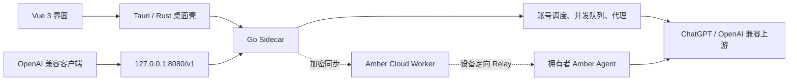

<div align="center">
  

  # Amber · 琥珀

  **把自己的 ChatGPT 订阅和 OpenAI 兼容账号，转换成本地 OpenAI 兼容 API。**

  Windows · Tauri v2 · Vue 3 · Go

  [下载最新版](https://github.com/oyg123less/sub2api-desktop/releases/latest) · [完整使用手册](docs/USAGE.md) · [问题排查](docs/USAGE.md#settings)
</div>

---

## Amber 是什么

Amber 是一个 Windows 桌面网关，在本机提供 OpenAI 兼容接口，默认地址为：

```text
http://127.0.0.1:8080/v1
```

Cherry Studio、Cursor、ChatBox、Codex 等客户端可以通过这个地址调用你导入的 ChatGPT OAuth 账号或 OpenAI 兼容 API 账号。Amber 负责账号调度、并发队列、代理、请求统计、Codex 配置，以及可选的加密云同步和连接码共享。

[](src/assets/docs/dashboard.png)

## 主要功能

| 功能 | 能做什么 |
|---|---|
| 统一账号导入 | Base URL + API Key、ChatGPT OAuth、单个/多个 JSON 文件 |
| 多账号调度 | 额度感知、并发上限、等待队列、自动恢复和故障停用 |
| 批处理 | 分页、当前页全选、批量测试、事务式批量删除 |
| 代理管理 | HTTP、HTTPS、SOCKS5、连通性分阶段测试、一键应用到全部账号 |
| OpenAI 兼容 API | `/v1/models`、Chat Completions、Responses 等兼容入口 |
| 模型与价格 | 模型卡片、Standard 官方价格、缓存和长上下文档 |
| 用量统计 | 请求、Token、延迟、错误类型和预估费用 |
| Codex 接入 | 本机配置、远程直连、SSH 反向隧道、备份与恢复 |
| Amber Cloud | 连接码 + 临时密码一键共享、多账号池、独立 Guest Key、工作区隔离与设备定向回流 |
| 本地运维 | 数据目录迁移、日志保留、内置诊断和版本更新提示 |

## 快速开始

### 1. 安装

从 [GitHub Releases](https://github.com/oyg123less/sub2api-desktop/releases/latest) 下载：

- `Amber_x.y.z_x64-setup.exe`：Windows NSIS 安装包，推荐。
- `Amber_x.y.z_x64_en-US.msi`：MSI 安装包，发布版本提供时可用。
- `SHA256SUMS.txt`：安装前校验文件完整性。

系统要求：

- Windows 10 或 Windows 11，64 位。
- Microsoft Edge WebView2 Runtime。Windows 11 通常已内置。

### 2. 导入账号

打开“账号 → 导入账号”，选择：

- Base URL + API Key
- ChatGPT 授权登录
- JSON 文件

[](src/assets/docs/import.png)

### 3. 启动服务

回到仪表盘启动服务，复制 Base URL 和本地 API Key。

### 4. 一键注入或配置客户端

Codex 用户优先进入“Codex 接入”：

- **本机接入**：选择模型后点击“一键注入”。
- **远程接入**：测试 SSH、核对服务器 SHA256 主机指纹，再点击“一键注入”。

远程服务器无法访问 ChatGPT 时，选择反向隧道，让服务器 Codex 通过本机 Amber 和本机代理访问上游。完整的主机密钥确认和故障检查见 [Codex 一键注入章节](docs/USAGE.md#codex)。

普通客户端在设置中选择 OpenAI 兼容服务：

在客户端中选择 OpenAI 兼容服务：

```text
Base URL: http://127.0.0.1:8080/v1
API Key:  仪表盘显示的 sk-local-...
```

先调用模型列表验证连接：

```bash
curl http://127.0.0.1:8080/v1/models \
  -H "Authorization: Bearer sk-local-替换为你的密钥"
```

从导入、代理、客户端、Codex 到云共享的完整步骤见 [Amber 使用手册](docs/USAGE.md)。手册采用可折叠章节，每项操作都配有对应截图和排障说明。

## 界面与工作流

README 只保留关键入口，不再堆放整组截图。需要查看具体页面时展开使用手册中的对应章节：

- [账号导入](docs/USAGE.md#import-accounts)
- [账号管理与批处理](docs/USAGE.md#manage-accounts)
- [代理批量配置](docs/USAGE.md#proxies)
- [客户端接入](docs/USAGE.md#client-setup)
- [模型广场](docs/USAGE.md#models)
- [统计与费用](docs/USAGE.md#statistics)
- [Codex 接入](docs/USAGE.md#codex)
- [云账户与共享](docs/USAGE.md#cloud)
- [设置与故障排查](docs/USAGE.md#settings)

## 架构



仓库结构：

```text
Amber/
├─ src/               Vue 3 前端
├─ src-tauri/         Tauri / Rust 桌面壳和打包配置
├─ core/              Go Sidecar、网关、账号、代理和存储
├─ cloud/             Cloudflare Worker、D1 迁移和云端测试
├─ docs/              使用手册与开发文档
├─ scripts/           构建、版本检查和文档截图脚本
└─ tests/e2e/         Playwright 端到端测试
```

## 数据与安全

- 账号、代理、设置和日志默认保存在本地数据目录。
- 敏感字段使用应用加密层保存，但本机数据目录和主密码仍需自行保护。
- Amber Cloud 只同步客户端加密后的保险库数据；OAuth 共享默认通过拥有者设备回源。
- 局域网访问默认关闭。不要把本地服务端口直接暴露到公网。
- 日志、截图和 Issue 中禁止提交 API Key、OAuth Token、云主密码、管理员密钥或真实账号信息。
- 非官方转发可能触发上游账号限制。任何代理、TLS profile 或兼容配置都不能保证账号安全。

## 从源码运行

### 环境

| 工具 | 建议版本 |
|---|---|
| Node.js | 24 LTS；最低使用 CI 所验证版本 |
| Go | 与 `core/go.mod` 保持一致 |
| Rust | stable，包含 MSVC 工具链 |
| WebView2 | 当前稳定版 |

Windows 本机开发建议安装 Node.js 24，并确认 `node --version` 输出 `v24.x`。本仓库在维护者电脑上禁止使用旧的系统 Node 18，具体约束见 [AGENTS.md](AGENTS.md)。

### 安装依赖并运行前端

```powershell
npm ci
npm run dev
```

### 运行桌面开发版

先构建 Sidecar：

```powershell
.\scripts\build-sidecar.ps1
npm run tauri dev
```

### 质量检查

```powershell
# 前端
npm run build
npm test
npm run test:e2e

# Go
Push-Location core
go test ./...
Pop-Location

# Cloud Worker
Push-Location cloud
npm ci
npm run typecheck
npm test
Pop-Location
```

### 打包

```powershell
.\scripts\build-all.ps1
```

产物目录：

```text
src-tauri\target\release\bundle\nsis\
src-tauri\target\release\bundle\msi\
```

打包只负责生成安装器，不应自动安装、卸载、停止或重启用户当前运行的 Amber。

## 常见问题

<details>
<summary><strong>客户端无法连接 127.0.0.1:8080</strong></summary>

确认仪表盘服务已启动、端口一致，且客户端没有把 `/v1` 重复拼成 `/v1/v1`。先使用 `/v1/models` 测试。

</details>

<details>
<summary><strong>客户端返回 401</strong></summary>

重新从仪表盘复制当前本地 API Key。重新生成 Key 后，旧 Key 会立即失效。

</details>

<details>
<summary><strong>账号显示限额或自动关闭</strong></summary>

打开账号详情查看状态原因和额度窗口。修复凭据或等待额度恢复后，先测试成功再开启账号。

</details>

<details>
<summary><strong>云同步失败或被拒绝</strong></summary>

确认云账户仍处于登录状态，然后使用“连接设置”检查 DNS、连接、TLS 和 HTTP 阶段。详细步骤见 [云账户章节](docs/USAGE.md#cloud)。

</details>

<details>
<summary><strong>远程 Codex 为什么必须保持本机 Amber 在线</strong></summary>

SSH 隧道和 OAuth 共享通过拥有者本机回源。本机 Amber 或路由关闭后，远程请求无法获得本机网络出口和 OAuth 环境。需要完全独立运行时使用可直接访问的 Base URL 与直连模式。

</details>

## 许可与使用边界

项目许可证见 [LICENSE](LICENSE)，第三方组件见 [THIRD_PARTY_NOTICES.md](THIRD_PARTY_NOTICES.md)。请遵守上游服务条款，不要用于未经授权的账号共享、公开转售或绕过访问控制。
