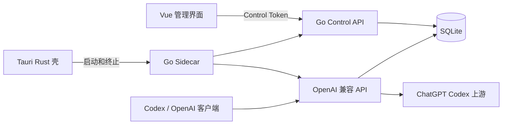
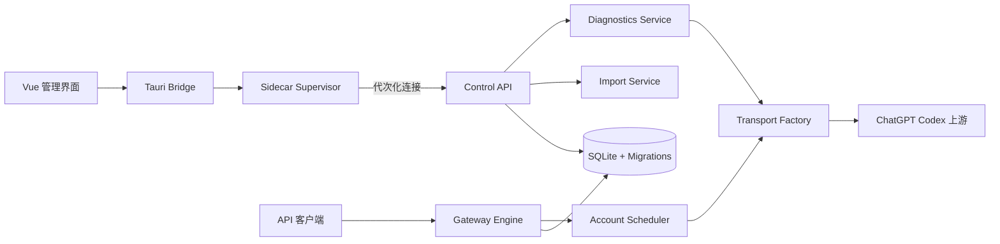

# Amber v0.2.0 开发规格

> 主题：可靠性、诊断能力与安全导入<br>
> 目标版本：`v0.2.0`<br>
> 开发基线：GitHub `v0.1.1`（tag `v0.1.1`，commit `280629b`）<br>
> 文档版本：`1.0`<br>
> 文档日期：`2026-07-10`<br>
> 状态：待评审

---

## 文档控制

| 项目 | 内容 |
|---|---|
| 产品 | Amber（琥珀）本地 OpenAI 兼容 API 网关 |
| 仓库 | `oyg123less/sub2api-desktop` |
| 当前发布基线 | `v0.1.1` |
| 目标发布 | `v0.2.0` |
| 主要平台 | Windows 10/11 x64 |
| 技术栈 | Tauri v2、Vue 3、TypeScript、Go、SQLite |
| 主要读者 | 产品负责人、开发者、测试人员、发布维护者 |
| 版本主题 | 后台自愈、诊断中心、安全导入、代理一致性、流式可靠性 |

### 变更记录

| 文档版本 | 日期 | 说明 |
|---|---|---|
| 1.0 | 2026-07-10 | 基于 v0.1.1 远程基线和本地代码审计建立首版规格 |

---

## 1. 执行摘要

Amber v0.2.0 不以增加更多模型名称或页面数量为主要目标，而是把 v0.1.1 从“功能完整的个人工具”提升为“可以长期运行、出现问题能够自愈并可诊断的桌面网关”。

本版本聚焦八个工作包：

1. Sidecar 生命周期管理与自动重连。
2. 一键诊断中心与脱敏报告。
3. 账号批量导入预检、去重和安全更新。
4. HTTP、HTTPS、SOCKS5 代理行为一致化。
5. 流式响应错误传播与 API 兼容边界明确化。
6. 基于额度和并发量的账号调度。
7. 日志保留、导出和数据库迁移安全。
8. 版本、构建、隐私和发布质量门禁。

v0.2.0 的成功标准不是“功能入口更多”，而是以下结果：

- 后台崩溃、数据目录迁移或控制端口变化后，用户不需要重启 Amber。
- 批量导入不会因缺失字段破坏已有账号，也不会把普通文本误报为有效账号。
- 代理测试与真实请求使用相同网络链路，不再出现“测试成功、调用失败”。
- 上游断流或 `response.failed` 不再被记录成成功。
- 用户可以生成不含密钥和 Token 的诊断报告，用于自助排障或提交 Issue。

---

## 2. v0.1.1 基线

### 2.1 已具备能力

v0.2.0 必须建立在远程 `v0.1.1` 上，不得从本地旧版 `0.1.0` 快照直接开发。v0.1.1 已包含：

- Tauri 单实例运行，避免重复启动多个 sidecar。
- Vue 管理界面、托盘、WebView2 GPU 兼容处理。
- OpenAI 兼容 `/v1/chat/completions` 与 `/v1/responses`。
- ChatGPT OAuth、账号导入、Token 刷新和 429 故障转移。
- HTTP、HTTPS、SOCKS5 代理配置与账号绑定。
- SQLite 存储和 AES-256-GCM 字段加密。
- Codex 配置一键应用、备份恢复、模型选择及配置文件编辑。
- 拒绝未知模型，不再静默回退到不相关模型。
- 请求日志记录真实上游模型。
- README、使用文档、可移植 PowerShell 构建脚本和 GitHub Release CI。

### 2.2 已确认的主要缺口

| 优先级 | 缺口 | 用户影响 | v0.2.0 处理方式 |
|---|---|---|---|
| P0 | 数据目录迁移后前端仍使用旧控制端口和令牌 | 后台失联，需重启应用 | 后台状态机、连接代次和事件订阅 |
| P0 | 编辑代理时空密码覆盖旧密码 | 认证代理突然失效 | Patch DTO，缺失密码表示保留 |
| P0 | 批量导入的部分字段更新会清空旧 Token | 可用账号被破坏 | 导入预检与字段合并规则 |
| P0 | 无账号 ID 的重复导入无法去重 | 重复账号和错误调度 | 已验证身份优先、凭据指纹兜底 |
| P0 | 上游流断开仍补正常结束并记录 200 | 客户端收到截断答案，日志误报 | 流错误分类和终止事件校验 |
| P1 | HTTPS 代理在指纹模式下未建立到代理的 TLS | 测试成功但真实转发失败 | 统一 TransportFactory |
| P1 | sidecar 崩溃后不会自动恢复 | 应用长期失联 | 有界自动重启和手动重启 |
| P1 | 账号总按创建顺序使用 | 第一个账号负载过高 | 额度感知调度器 |
| P1 | 请求日志无限增长 | 数据库膨胀、统计变慢 | 保留策略和后台清理 |
| P1 | 诊断信息分散且运行日志不可见 | 用户无法准确反馈问题 | 诊断中心和脱敏导出 |

### 2.3 基线确认任务

开发开始前必须完成：

- 从 tag `v0.1.1` 创建开发分支。
- 运行 `go test ./...`、`go vet ./...`、`npm run build`。
- 在 Windows 11 上启动一次 Tauri 应用并确认单实例行为。
- 记录 v0.1.1 的数据库副本，用于升级迁移测试。
- 对比本地 Amber 工作目录与远程 v0.1.1，禁止把旧快照覆盖到主线。

<!-- pdf:pagebreak -->

## 3. 版本目标与非目标

### 3.1 产品目标

| 编号 | 目标 | 可量化标准 |
|---|---|---|
| G-01 | 后台连接可恢复 | sidecar 非预期退出后 10 秒内恢复，最多有界重试 |
| G-02 | 导入结果可信 | 无效行不计入成功；重复导入不新增重复账号 |
| G-03 | 代理行为一致 | 代理测试和真实转发共用同一 TransportFactory |
| G-04 | 流错误可观察 | 无终止事件、扫描错误、上游失败均记录明确错误类型 |
| G-05 | 多账号使用更均衡 | 默认策略综合额度、并发和最近使用时间选择账号 |
| G-06 | 诊断信息可交付 | 一键生成 JSON/文本报告，自动脱敏全部凭据 |
| G-07 | 升级可回滚 | 数据库迁移前自动备份，失败时恢复原数据库 |
| G-08 | 发布可复现 | CI 自动执行测试、注入版本并生成安装包与校验值 |

### 3.2 工程目标

- 为导入、代理、sidecar 生命周期、流式错误增加自动测试。
- 引入显式数据库迁移版本，不继续依赖零散 `ALTER TABLE`。
- 所有新增控制接口使用统一错误结构和错误码。
- 新增日志不得输出 access token、refresh token、id token、API Key 或代理密码。
- 保留 v0.1.1 配置兼容，用户升级后无需重新登录账号。

### 3.3 非目标

以下内容不进入 v0.2.0：

- 新增 Anthropic `/v1/messages` 公共接口。
- 云端同步、多用户、团队权限和远程管理面板。
- 自动购买、自动注册或自动获取第三方账号。
- 绕过上游计费、访问控制或账号限制的功能。
- 完整实现 OpenAI API 的音频、图像生成、Batch 和 Realtime API。
- 大规模重写 Vue、Tauri 或 Go 技术栈。
- 无验证依据地宣称“防封号”；界面统一改称“客户端兼容模式”。

---

## 4. 目标架构

### 4.1 当前架构



### 4.2 v0.2.0 目标架构



### 4.3 设计原则

1. **单一实现来源**：代理测试、OAuth Token 交换和真实转发共享网络构建逻辑。
2. **连接有代次**：每次 sidecar 重启产生新的 `generation`，旧端口和令牌立即失效。
3. **预检后提交**：账号导入先展示动作和警告，再执行事务写入。
4. **失败不可伪装成功**：流断开、缺少终止事件和上游失败必须可见。
5. **默认安全**：LAN 默认关闭，敏感信息默认遮罩，诊断默认脱敏。
6. **升级可回滚**：数据库和数据目录操作先备份、后切换、最后清理。
7. **范围真实**：不支持的 API 参数明确报错，不静默丢弃。

---

## 5. 工作包 EPIC-01：后台生命周期与自动自愈

### 5.1 用户故事

- 作为用户，我移动数据目录后不需要重启 Amber。
- 作为用户，我能看到后台是启动中、运行中、重连中还是失败。
- 作为用户，后台崩溃时 Amber 能自动恢复，并在失败后给出可操作信息。
- 作为开发者，我能区分用户主动退出、数据迁移重启和异常崩溃。

### 5.2 后台状态机

新增 Rust 侧状态：

```text
stopped -> starting -> ready
starting -> failed
ready -> restarting -> starting
ready -> migrating -> starting
ready -> stopped
```

状态对象：

```ts
interface BackendState {
  phase: "stopped" | "starting" | "ready" | "restarting" | "migrating" | "failed";
  generation: number;
  control_port: number;
  restart_count: number;
  started_at?: string;
  last_ready_at?: string;
  last_exit_code?: number;
  last_error?: string;
}
```

`control_token` 不进入普通状态对象，只通过现有受控连接命令传给前端内存。

### 5.3 Rust 命令与事件

| 类型 | 名称 | 用途 |
|---|---|---|
| Command | `get_backend_state` | 获取当前 sidecar 状态 |
| Command | `get_connection` | 获取当前代次的控制连接 |
| Command | `restart_backend` | 用户手动重启后台 |
| Event | `backend-state-changed` | 状态变化通知 |
| Event | `sidecar-ready` | 新连接建立，携带 `generation` |
| Event | `sidecar-output` | 仅传递已经脱敏的最近运行日志 |

### 5.4 握手处理

- 为 stdout 增加跨事件缓冲，不能假设一次 `CommandEvent::Stdout` 就是一整行。
- 只接受前缀为 `SUB2API_READY ` 且 JSON 字段完整的握手。
- 验证 `control_port` 范围为 `1..65535`，Token 长度至少 32 字节。
- 收到新握手后原子更新连接和 `generation`，再通知前端。
- sidecar 退出时立即清空连接，禁止继续暴露旧端口和旧令牌。

### 5.5 自动重启策略

- 仅对非预期退出自动重启。
- 用户退出、安装器卸载、数据迁移期间不得触发自动重启。
- 退避间隔：1 秒、2 秒、5 秒、15 秒、30 秒。
- 10 分钟内最多自动重启 5 次，超过后进入 `failed`。
- 进入 `failed` 后保留“重试后台”按钮。
- sidecar 连续稳定运行 10 分钟后清零重启计数。

### 5.6 前端连接策略

- `main.ts` 不再使用固定 40 次启动轮询作为唯一连接方式。
- 启动时读取状态，同时订阅 `backend-state-changed` 和 `sidecar-ready`。
- `sidecar-ready` 的 `generation` 高于当前值时，原子替换 `window.__SUB2API__`。
- 控制请求遇到网络错误或 401 时，主动重新读取一次连接后重试一次。
- 禁止无限重试；第二次失败交由 UI 展示。

### 5.7 数据目录迁移

迁移流程必须改为：

1. 验证目标目录可写且不与当前目录相同。
2. 如果目标存在 `sub2api.db` 或 `key`，默认拒绝覆盖。
3. 将 supervisor 置为 `migrating` 并暂停自动重启。
4. 停止 API 服务并等待 sidecar 退出，最长 5 秒。
5. 将数据复制到目标临时目录 `.amber-migration-<uuid>`。
6. 校验数据库能打开、密钥能解密至少一个敏感字段。
7. 原子写入 `location.json.tmp`，再替换 `location.json`。
8. 从新目录启动 sidecar，并等待 `ready`，最长 15 秒。
9. 成功后保留旧目录为带时间戳备份；由用户后续确认删除。
10. 任一步失败时恢复旧指针和旧 sidecar。

### 5.8 验收标准

- 数据目录迁移后 15 秒内恢复控制 API，不重启桌面应用。
- 人为终止 sidecar 后可自动恢复，前端状态变化完整。
- 连续启动失败不会产生无限进程或无限重试。
- 退出 Amber 后没有残留 sidecar。
- 所有状态转换有 Rust 单元测试或集成测试。

<!-- pdf:pagebreak -->

## 6. 工作包 EPIC-02：诊断中心

### 6.1 页面定位

新增“诊断”页面，放在“统计”和“设置”之间。页面强调扫描和结果，不展示实现说明。

### 6.2 诊断项目

| 检查项 | 检查内容 | 超时 | 失败级别 |
|---|---|---:|---|
| 桌面后台 | sidecar 状态、代次、重启次数 | 1s | 阻断 |
| 数据目录 | 可读写、数据库和密钥存在性 | 2s | 阻断 |
| SQLite | `PRAGMA quick_check`、schema version | 5s | 阻断 |
| API 监听 | 端口、host、健康检查 | 2s | 阻断 |
| 账号池 | 可用、待验证、限额、失效数量 | 2s | 警告 |
| 代理 | 仅测试被账号使用的代理 | 每个 15s | 警告 |
| OAuth | 回调端口占用、Token 刷新能力 | 5s | 警告 |
| ChatGPT | DNS、TLS、HTTP 可达性 | 15s | 阻断 |
| 模型 | 默认模型和 Codex 模型映射 | 3s | 警告 |
| Codex 配置 | TOML/JSON 格式、Base URL、密钥字段 | 2s | 警告 |
| 日志健康 | DB 大小、日志条数、最近错误类型 | 2s | 信息 |
| 版本一致性 | UI、Tauri、sidecar 版本 | 1s | 警告 |

### 6.3 运行模型

诊断采用后台任务，避免单个 HTTP 请求长时间阻塞：

```http
POST /control/diagnostics/runs
GET  /control/diagnostics/runs/{run_id}
GET  /control/diagnostics/runs/{run_id}/report?format=json
GET  /control/diagnostics/runs/{run_id}/report?format=text
```

创建响应：

```json
{
  "run_id": "diag_01J...",
  "status": "running",
  "created_at": "2026-07-10T12:00:00+08:00"
}
```

状态响应：

```json
{
  "run_id": "diag_01J...",
  "status": "completed",
  "progress": 100,
  "summary": { "ok": 8, "warning": 2, "failed": 0 },
  "checks": [
    {
      "id": "backend",
      "status": "ok",
      "title": "桌面后台",
      "duration_ms": 18,
      "message": "后台运行正常"
    }
  ]
}
```

### 6.4 脱敏规则

导出前统一调用 `redact.Sanitize`：

- `sk-local-*` 只保留前 8 位和后 4 位。
- JWT、OAuth Token、Control Token 全部替换为 `<redacted-token>`。
- 代理密码替换为 `<redacted-password>`。
- URL 用户信息部分删除。
- 用户目录保留最后两级，用户名替换为 `<user>`。
- 请求体、对话内容和 Codex `auth.json` 不进入诊断报告。
- 邮箱默认掩码为 `a***@example.com`。

### 6.5 UI 状态

- 未运行：显示“开始诊断”。
- 运行中：稳定高度的进度条和逐项状态。
- 完成：按失败、警告、正常排序。
- 失败项提供“重试此项”，不自动执行破坏性修复。
- 支持复制摘要、导出 JSON、导出文本。

### 6.6 验收标准

- 无账号和无代理环境也能完成诊断。
- 任一外部请求超时不会阻塞其他检查。
- 导出报告中不出现完整 Token、Key、密码和对话内容。
- 诊断结果可以明确区分端口占用、代理认证失败、TLS 失败和上游 401/429。

---

## 7. 工作包 EPIC-03：安全批量导入

### 7.1 目标

将批量导入从“解析后立即写库”改为“规范化、预检、预览、确认、事务提交、可选验证”的两阶段流程。

### 7.2 输入支持范围

继续支持：

- 账号数组 `[{...}]`。
- 包装对象 `{ "accounts": [...] }`。
- Codex CLI `auth.json` 的 `tokens` 结构。
- sub2api 备份的 `credentials` 结构。
- snake_case 和 camelCase 字段。
- 一行一个 Token，但必须通过 Token 基础格式验证。

新增输入规范化：

- 去除 UTF-8 BOM。
- 识别 UTF-8、UTF-16LE、UTF-16BE；其他编码明确拒绝。
- 限制文件为 10 MiB，超出返回 HTTP 413，不得静默截断。
- JSON 解析失败时不得自动把疑似 JSON 的每一行当 Token。
- 普通文本行必须匹配 JWT 三段式或已知 OpenAI Token 前缀，否则标记错误。
- 不接受注释、表头或包含空格的任意文本作为 Token。

### 7.3 两阶段 API

```http
POST /control/accounts/import/preview
Content-Type: application/octet-stream

<原始文件内容>
```

预览响应不得返回任何完整 Token：

```json
{
  "content_sha256": "f2a1...",
  "summary": {
    "total": 3,
    "create": 1,
    "update": 1,
    "skip": 0,
    "error": 1
  },
  "rows": [
    {
      "index": 1,
      "action": "update",
      "matched_account_id": 12,
      "email_masked": "a***@example.com",
      "chatgpt_account_id_masked": "acct_...83f1",
      "has_access_token": true,
      "has_refresh_token": true,
      "identity_verified": true,
      "warnings": []
    }
  ]
}
```

确认提交：

```http
POST /control/accounts/import/commit
Content-Type: application/octet-stream
X-Import-Preview-SHA256: f2a1...
X-Validate-After-Import: true

<同一份原始文件内容>
```

后端重新计算 SHA-256；内容变化时返回 `409 import_preview_mismatch`。

### 7.4 Token 验证层级

| 层级 | 含义 | 可否用于显示 | 可否用于覆盖已有账号 |
|---|---|---|---|
| `unparsed` | 非 JWT 或无法解码 | 否 | 否 |
| `decoded` | 仅解码 payload | 可显示为“未验证” | 否 |
| `signed` | JWKS 签名、issuer、audience 通过 | 是 | 是 |
| `live` | 实际刷新或最小请求成功 | 是 | 是，且状态设为 active |

实现要求：

- 引入维护良好的 JWT/JWKS 库，缓存 OpenAI JWKS，遵循缓存头。
- 过期但签名有效的 ID Token 可以提供可信账号身份，但必须产生 `token_expired` 警告。
- JWKS 暂时不可用时不得把未验证 claims 用于覆盖决策。
- 显式提供的 `chatgpt_account_id` 只能在来源格式受信或现场验证成功后参与覆盖。

### 7.5 去重优先级

1. 已验证 ID Token 中的 `chatgpt_account_id`。
2. 已验证 access token 中的账号身份。
3. 完全相同 refresh token 的 SHA-256 指纹。
4. 完全相同 access token 的 SHA-256 指纹。
5. 无可靠身份时创建新账号，但明确标记 `pending_validation`。

邮箱不得作为唯一去重键，因为同一邮箱可能存在多个 workspace 或组织身份。

### 7.6 字段合并规则

| 字段 | 导入值为空 | 导入值非空且可信 |
|---|---|---|
| `access_token` | 保留旧值 | 替换 |
| `refresh_token` | 保留旧值 | 替换 |
| `id_token` | 保留旧值 | 替换 |
| `expires_at` | access 未变化时保留；变化时设未知并警告 | 替换 |
| `email` | 保留旧值 | 已验证身份才更新 |
| `chatgpt_account_id` | 保留旧值 | 已验证身份才更新 |
| `plan_type` | 保留旧值 | 已验证身份才更新 |
| `proxy_id` | 始终保留 | 导入流程不修改代理绑定 |
| `status` | 不因写库直接设 active | live 验证成功后设 active |

### 7.7 数据库约束

- 新增 `credential_fingerprint`，只存 SHA-256，不存明文 Token。
- 对非空 `chatgpt_account_id` 建立部分唯一索引。
- 对非空 `credential_fingerprint` 建立普通索引，用于预检查重。
- 新增状态 `pending_validation`。
- 导入提交必须在单个 SQLite 事务中完成。
- 任一数据库错误导致整个提交回滚；格式错误行可由用户在预览阶段主动排除后再提交。

### 7.8 导入 UI

```text
┌─────────────────────────────────────────────────────────┐
│ 批量导入账号                              预检完成       │
├────┬────────┬────────────────────┬──────────┬───────────┤
│ #  │ 动作   │ 账号               │ 凭据     │ 提示      │
├────┼────────┼────────────────────┼──────────┼───────────┤
│ 1  │ 更新   │ a***@example.com   │ A / R / I│ 无        │
│ 2  │ 新增   │ b***@example.com   │ A / R    │ 待验证    │
│ 3  │ 错误   │ -                  │ -        │ 非法文本  │
└────┴────────┴────────────────────┴──────────┴───────────┘
  [x] 导入后验证账号                    [取消] [确认导入 2]
```

- 错误和警告必须留在弹窗内，不使用短暂 Toast 承载详细结果。
- 用户可展开单行查看原因，但不得显示完整 Token。
- 提交完成后保留结果页，支持复制失败项摘要。
- 导入后验证并发数固定为 2，避免同时触发大量上游请求。

### 7.9 验收标准

- 重复导入同一文件不会增加账号数量。
- 只提供 refresh token 更新时不会清空已有 access/id token。
- UTF-8 BOM 和 UTF-16 JSON 可正确识别。
- 普通说明文字不会被计为导入成功。
- 超过大小限制返回 413，数据库无新增记录。
- 伪造 ID Token 不能覆盖已有账号。
- 1000 条预览在普通桌面环境下 2 秒内完成，不包含在线验证时间。
- 导入模块拥有独立单元测试和数据库集成测试。

<!-- pdf:pagebreak -->

## 8. 工作包 EPIC-04：代理一致性

### 8.1 统一 TransportFactory

新增 `internal/transport`，负责构建所有外部 HTTP Client：

```go
type Purpose string

const (
    PurposeGateway    Purpose = "gateway"
    PurposeOAuth      Purpose = "oauth"
    PurposeProxyTest  Purpose = "proxy_test"
    PurposeDiagnostic Purpose = "diagnostic"
)

type Options struct {
    Proxy              *store.Proxy
    Purpose            Purpose
    FingerprintProfile string
    Timeout            time.Duration
}
```

网关、账号测试、OAuth、代理测试和诊断不得各自创建不同的 `http.Transport`。

### 8.2 代理编辑语义

`PUT /control/proxies/{id}` 使用显式 DTO：

```json
{
  "name": "Tokyo",
  "type": "https",
  "host": "proxy.example.com",
  "port": 443,
  "username": "user",
  "password": null,
  "clear_password": false
}
```

- `password` 缺失或 `null`：保留旧密码。
- `password` 非空：更新密码。
- `clear_password=true`：明确清空密码。
- 响应永远不返回密码。

### 8.3 HTTPS 代理

正确链路：

```text
TCP -> TLS(proxy host) -> CONNECT(chatgpt.com:443) -> TLS(target) -> HTTP
```

要求：

- 校验代理服务器证书和 SNI。
- 代理认证只发给代理，不得转发到目标服务器。
- CONNECT 响应体按规范关闭或耗尽，不破坏底层连接。
- SOCKS5 拨号支持 context 和超时。
- 错误类型区分 `proxy_connect`、`proxy_auth`、`proxy_tls`、`target_tls`、`target_http`。

### 8.4 指纹配置

- 将“反封号”文案改为“客户端兼容模式”。
- 明确提供 `standard`、`codex`、`legacy_node24` 三种 profile。
- `codex` profile 必须有取证来源和自动化握手快照测试。
- User-Agent、originator 与 TLS profile 必须属于同一客户端族。
- 如果无法维护真实 Codex profile，默认使用 `standard`，不得用不匹配指纹制造虚假安全感。

### 8.5 OAuth 代理

- OAuth 登录弹窗允许选择“直连”或已有代理。
- 选择项传入现有 `oauthStart(proxy_id)`。
- 浏览器授权页仍由系统浏览器处理；选定代理只保证 Token 交换走该代理。
- UI 必须说明浏览器本身受系统代理设置控制。

### 8.6 验收标准

- 修改代理名称但不输入密码，旧密码仍可使用。
- HTTP、HTTPS、SOCKS5 代理均通过同一组集成测试。
- 代理测试成功后，同账号最小模型请求也成功。
- 代理认证信息不出现在日志和错误报告中。
- OAuth Token 交换可以使用用户选定代理。

---

## 9. 工作包 EPIC-05：流式可靠性与 API 契约

### 9.1 错误分类

新增稳定错误码：

| error_kind | 含义 | 建议 HTTP 状态 |
|---|---|---:|
| `client_cancelled` | 客户端主动断开 | 不再写响应 |
| `request_invalid` | 参数或 JSON 错误 | 400 |
| `unsupported_parameter` | 参数已识别但不支持 | 400 |
| `auth_refresh_failed` | OAuth 刷新失败 | 502/503 |
| `account_unauthorized` | 上游 401/403 | 503，允许故障转移 |
| `account_rate_limited` | 上游 429 | 503，允许故障转移 |
| `upstream_timeout` | 上游超时 | 504 |
| `upstream_stream_error` | SSE 扫描或连接中断 | 502 或流内错误 |
| `upstream_failed_event` | 收到 `response.failed` | 502 或流内错误 |
| `proxy_error` | 代理链路失败 | 502 |
| `internal_error` | 本地不可恢复错误 | 500 |

### 9.2 SSE 终止规则

- 成功必须观察到 `response.completed` 或等价合法终止事件。
- `Scanner.Err()` 非空时不得调用正常 finalize。
- `response.failed` 必须提取上游错误并记录失败。
- `response.incomplete` 根据原因映射为 `length` 或明确错误。
- 如果尚未向客户端写出正文，返回标准 HTTP 错误。
- 如果已经开始流式输出，发送一个 OpenAI 风格 `error` 数据事件后关闭，不发送 `[DONE]`。
- 客户端取消不计为服务失败，但日志记录 `client_cancelled`。

### 9.3 `/v1/responses` 非流式支持

- 保留上游强制流式机制。
- 客户端 `stream=true` 时原样流式转发并校验终止。
- 客户端 `stream=false` 或缺失时，在本地聚合 SSE 为单个 Responses JSON。
- 使用现有 `BufferedResponseAccumulator`，补充失败和 usage 测试。

### 9.4 参数处理原则

| 参数 | v0.2.0 行为 |
|---|---|
| `messages` / `input` | 支持并严格校验 |
| `stream` | Chat 与 Responses 均支持 true/false |
| `tools` / `tool_choice` | 支持 |
| `reasoning_effort` | 支持并规范化 |
| `max_tokens` | 映射为 `max_output_tokens` |
| `temperature` / `top_p` | 非 reasoning 模型透传 |
| `stop` | 如果上游无法实现，返回 `unsupported_parameter`，不得静默忽略 |
| `n`、`logprobs`、音频字段 | 返回明确不支持错误 |
| 未知字段 | 仅真正可忽略扩展可以忽略；影响语义的字段必须报错 |

### 9.5 请求日志扩展

新增：

- `request_id`
- `requested_model`
- `resolved_model`
- `error_kind`
- `attempt_count`
- `terminal_event`

不记录请求正文和响应正文。

### 9.6 验收标准

- 模拟上游中途断开时日志不是 200 success。
- `response.failed` 能被 Chat 和 Responses 两条路径正确暴露。
- `/v1/responses` 非流式返回 JSON，而不是 SSE。
- 不支持参数返回稳定错误码。
- 工具调用、reasoning、usage 和 `[DONE]` 的现有兼容行为不回归。

---

## 10. 工作包 EPIC-06：额度感知账号调度

### 10.1 策略

新增设置 `account_strategy`：

| 值 | 行为 | 用途 |
|---|---|---|
| `failover` | 保持 v0.1.1 创建顺序 | 兼容旧行为 |
| `round_robin` | 可用账号轮询 | 均匀简单流量 |
| `quota_aware` | 综合额度、并发、状态和最近使用 | v0.2.0 默认 |

### 10.2 候选过滤

排除：

- `disabled`。
- 尚未到期的 `rate_limited`。
- 连续刷新失败且未到重试时间的账号。
- 明确无 access token 且无 refresh token 的账号。

`pending_validation` 可以参与首次请求，但优先级低于已验证 active 账号。

### 10.3 quota_aware 排序

排序因素从高到低：

1. 状态：active 优先。
2. 已知额度使用率：取 primary/secondary 中更高值，低者优先。
3. 当前 `in_flight` 数量，低者优先。
4. 最近使用时间，最久未使用者优先。
5. 创建时间和 ID 作为稳定排序。

调度器在内存记录 `in_flight`，请求结束必须 `defer` 释放。

### 10.4 状态修复

- 成功请求自动设为 active，清空过期 `rate_limited_until` 和旧错误原因。
- 401/403 时先强制刷新 Token 并重试同账号一次，再标记失败并切换。
- 429 使用额度响应头决定恢复时间。
- 网络错误不得直接把账号标记为鉴权失败。
- 连续失败次数和最后成功时间写入数据库。

### 10.5 验收标准

- 三账号并发请求不再全部压到最早创建账号。
- 限额恢复后账号状态自动回到 active。
- 网络断开不会批量污染账号状态。
- 现有 429 failover 测试继续通过，并新增 round-robin/quota-aware 测试。

<!-- pdf:pagebreak -->

## 11. 工作包 EPIC-07：日志、数据与迁移

### 11.1 显式数据库迁移

新增：

```sql
CREATE TABLE schema_migrations (
    version INTEGER PRIMARY KEY,
    name TEXT NOT NULL,
    applied_at INTEGER NOT NULL
);
```

迁移必须按版本顺序、在事务内执行。应用启动时：

1. 检测当前 schema。
2. 在数据目录创建 `sub2api.db.pre-v0.2.0-<timestamp>.bak`。
3. 执行迁移。
4. 执行 `PRAGMA quick_check`。
5. 失败则关闭新 DB 并恢复备份。

### 11.2 v0.2.0 Schema 变更

`accounts`：

```sql
ALTER TABLE accounts ADD COLUMN credential_fingerprint TEXT NOT NULL DEFAULT '';
ALTER TABLE accounts ADD COLUMN last_success_at INTEGER NOT NULL DEFAULT 0;
ALTER TABLE accounts ADD COLUMN consecutive_failures INTEGER NOT NULL DEFAULT 0;
ALTER TABLE accounts ADD COLUMN next_retry_at INTEGER NOT NULL DEFAULT 0;
CREATE INDEX idx_accounts_fingerprint ON accounts(credential_fingerprint);
CREATE UNIQUE INDEX idx_accounts_chatgpt_id_unique
ON accounts(chatgpt_account_id)
WHERE chatgpt_account_id <> '';
```

`request_logs`：

```sql
ALTER TABLE request_logs ADD COLUMN request_id TEXT NOT NULL DEFAULT '';
ALTER TABLE request_logs ADD COLUMN requested_model TEXT NOT NULL DEFAULT '';
ALTER TABLE request_logs ADD COLUMN resolved_model TEXT NOT NULL DEFAULT '';
ALTER TABLE request_logs ADD COLUMN error_kind TEXT NOT NULL DEFAULT '';
ALTER TABLE request_logs ADD COLUMN attempt_count INTEGER NOT NULL DEFAULT 1;
ALTER TABLE request_logs ADD COLUMN terminal_event TEXT NOT NULL DEFAULT '';
```

### 11.3 历史重复账号迁移

创建唯一索引前：

- 找出非空 `chatgpt_account_id` 重复组。
- 选择 `updated_at` 最新的记录为主记录。
- 保留最早 `created_at`。
- 从组内选择最新非空 Token 集和非空代理绑定。
- 将 `request_logs.account_id` 重指向主记录。
- 在 `migration_audit` 记录被合并的账号 ID。
- 删除重复记录后再创建唯一索引。
- 整个过程依赖升级前备份，失败必须回滚。

### 11.4 日志保留

新增设置：

```json
{
  "log_retention_days": 30,
  "max_log_rows": 100000
}
```

- 每次启动后异步清理一次，每 24 小时再清理一次。
- 两个条件任一满足即删除最旧记录。
- 清理采用小批量事务，每批最多 1000 行，避免长时间锁库。
- 设置页面支持 7、30、90、永久保留。
- 统计页面支持导出 CSV/JSON 和手动清空日志，清空需要二次确认。

### 11.5 验收标准

- v0.1.1 数据库升级后账号、代理、设置、日志完整。
- 人为制造迁移错误时可以恢复原数据库。
- 10 万条日志清理不会让控制 API 长时间无响应。
- 导出内容不含任何凭据。

---

## 12. 工作包 EPIC-08：安全、版本与发布质量

### 12.1 版本一致性

- `package.json`、`tauri.conf.json`、Cargo package 和 sidecar 使用同一版本来源。
- 构建 sidecar 时由脚本注入：

```powershell
go build -ldflags "-X main.version=$version" ...
```

- 诊断中心比较四处版本，不一致时给出警告。

### 12.2 LAN 模式

- 开启 LAN 前弹出风险确认。
- 显示真实局域网访问地址，不再只显示 `127.0.0.1`。
- 本地 API Key 长度和随机性继续保持当前强度。
- 明确说明 LAN 模式为 HTTP，不应暴露到公网。
- 不在 v0.2.0 内自建 TLS 证书；远程使用推荐 SSH 隧道或可信反向代理。

### 12.3 Codex 配置保护

- 保存前解析 TOML 和 JSON，不仅做字符串包含检查。
- 使用临时文件加原子替换。
- 展示当前备份时间和来源版本。
- 恢复前再次备份当前编辑内容，避免用户在应用期间的修改丢失。

### 12.4 敏感信息策略

- 建立统一 `redact` 包，日志、诊断和 API 错误都使用它。
- 数据库字段加密能力保持兼容。
- 文档明确说明：密钥和数据库同目录的 AES 加密不等同于 Windows DPAPI。
- DPAPI/系统凭据库升级作为 v0.3.0 候选，不在本版本仓促引入。

### 12.5 许可与文案

- 仓库根目录补充明确的许可文件和第三方组件清单。
- 核对 LGPL 组件的修改与分发义务。
- “反封号”统一改为“客户端兼容模式”，并保留风险提示。
- 第三方商店入口不扩展新能力；交易、账号来源和服务条款风险另行评审。

### 12.6 CI 质量门禁

每个 PR 必须执行：

```text
go fmt check
go vet ./...
go test -race ./...
npm ci
npm run build
cargo fmt --check
cargo clippy -- -D warnings
cargo test
```

Release 工作流额外执行：

- Windows sidecar release 构建。
- Tauri NSIS/MSI 构建。
- sidecar `--version` 与 tag 一致性检查。
- 安装包 SHA-256 生成。
- 从空白用户目录启动的冒烟测试。

---

## 13. 控制 API 总表

### 13.1 新增接口

| 方法 | 路径 | 用途 |
|---|---|---|
| POST | `/control/accounts/import/preview` | 导入预检 |
| POST | `/control/accounts/import/commit` | 确认导入 |
| POST | `/control/diagnostics/runs` | 创建诊断任务 |
| GET | `/control/diagnostics/runs/{id}` | 查询诊断进度 |
| GET | `/control/diagnostics/runs/{id}/report` | 导出脱敏报告 |
| DELETE | `/control/logs` | 按策略清理或全部清空 |
| GET | `/control/logs/export` | 导出 CSV/JSON |

### 13.2 调整接口

| 方法 | 路径 | 调整 |
|---|---|---|
| PUT | `/control/proxies/{id}` | 密码改为 patch 语义 |
| GET | `/control/status` | 增加 schema、日志和调度摘要 |
| PUT | `/control/settings` | 增加账号策略和日志保留配置 |
| POST | `/control/accounts/{id}/test` | 返回结构化错误类型 |

### 13.3 统一错误结构

```json
{
  "error": {
    "code": "import_preview_mismatch",
    "message": "导入内容与预检内容不一致，请重新预检",
    "retryable": false,
    "details": {
      "expected_sha256": "f2a1..."
    }
  }
}
```

要求：

- `code` 稳定，适合前端分支和测试断言。
- `message` 可本地化，不作为程序判断依据。
- `details` 不得包含敏感值。
- v0.1.1 旧前端仍可读取顶层或嵌套 message；v0.2.0 前端优先使用新结构。

---

## 14. 前端规格

### 14.1 导航

```text
仪表盘
账号
代理
统计
诊断   <- 新增
设置
Codex 接入
购买账号
使用文档
```

### 14.2 全局后台状态

侧边栏状态从二元值扩展为：

- 绿色：运行中。
- 黄色：启动中、重连中、迁移中。
- 红色：启动失败。
- 灰色：已停止。

失败状态提供重试图标按钮和 Tooltip，不在侧边栏堆叠长错误文本。

### 14.3 账号页

- 批量导入改为三步：选择/粘贴、预检、结果。
- 每个账号显示验证状态、最近成功时间和下一次重试时间。
- 额度条继续按真实窗口分钟数展示。
- 提供调度策略下的“当前优先级”说明，但不暴露复杂分数。

### 14.4 代理页

- 密码字段显示“留空表示保留原密码”。
- 增加明确的“清除密码”操作。
- 测试结果显示阶段：连接代理、代理认证、目标 TLS、目标 HTTP。
- HTTPS 代理使用独立标签，避免与普通 HTTP 混淆。

### 14.5 统计页

- 日志增加 `error_kind`、实际模型和尝试次数。
- 增加导出与保留策略入口。
- 当数据被保留策略清理时显示统计范围，而不是误认为全量数据。

### 14.6 设置页

新增：

- 账号调度策略。
- 日志保留时间。
- 客户端兼容模式 profile。
- 后台自动恢复开关，默认开启。

修改设置后需要重启 API 服务的字段，应显示待应用状态并提供“一键重启服务”。

### 14.7 可访问性

- 所有状态不能只依赖颜色。
- Modal 支持 Escape、焦点陷阱和回到触发按钮。
- 图标按钮必须有 Tooltip 或 `aria-label`。
- 长账号 ID、路径和错误文本必须可换行或截断并支持复制。
- 进度和动态诊断结果使用适当的 ARIA live 区域。

<!-- pdf:pagebreak -->

## 15. 代码改动地图

| 模块 | 主要文件/目录 | 预计改动 |
|---|---|---|
| Tauri supervisor | `src-tauri/src/lib.rs`、新 `supervisor.rs` | 状态机、重启、事件、迁移 |
| 前端连接 | `src/main.ts`、`src/tauri.ts`、`src/store.ts` | 代次连接、事件订阅、单次重试 |
| 诊断 | 新 `core/internal/diagnostics/`、新 `src/views/Diagnostics.vue` | 任务、检查、导出和 UI |
| 导入解析 | `core/internal/account/parse.go` | 编码、格式、严格解析 |
| 导入服务 | `core/internal/account/import.go` | 预览、合并、事务、验证 |
| 账号存储 | `core/internal/store/accounts.go` | 指纹、唯一性、状态字段 |
| 数据迁移 | 新 `core/internal/store/migrations/` | schema version、备份、回滚 |
| 代理 DTO | `core/internal/control/control.go`、`src/api/control.ts` | patch 语义 |
| Transport | 新 `core/internal/transport/` | HTTP/HTTPS/SOCKS5 统一实现 |
| 流式网关 | `core/internal/gateway/stream.go`、`responses.go` | 终止校验、错误传播、非流聚合 |
| 调度器 | 新 `core/internal/gateway/scheduler.go` | 三种策略、in-flight |
| 日志 | `core/internal/store/logs.go`、Statistics 页面 | 新字段、清理、导出 |
| i18n | `src/i18n.ts` | 中英文完整文案 |
| 构建发布 | `scripts/`、`.github/workflows/release.yml` | 版本注入、质量门禁、校验值 |

### 15.1 建议拆分 PR

| PR | 范围 | 依赖 |
|---|---|---|
| PR-01 | schema migrations + v0.1.1 升级备份 | 无 |
| PR-02 | sidecar supervisor + frontend reconnect | PR-01 |
| PR-03 | 严格导入 parser + preview API | PR-01 |
| PR-04 | import commit + UI + identity validation | PR-03 |
| PR-05 | TransportFactory + 代理 patch 语义 | PR-01 |
| PR-06 | 流式错误与 Responses 非流式 | PR-01 |
| PR-07 | quota-aware scheduler | PR-01、PR-06 |
| PR-08 | diagnostics service + UI | PR-02、PR-05、PR-06 |
| PR-09 | 日志保留、导出、设置 UI | PR-01 |
| PR-10 | 文案、文档、CI 和发布候选 | 全部 |

每个 PR 应独立可审查，不把数据库迁移、UI 重做和网关协议转换混在同一提交中。

---

## 16. 测试策略

### 16.1 单元测试

| 模块 | 必测场景 |
|---|---|
| Import parser | BOM、UTF-16、JSON stream、未知字段、普通文本、超大输入 |
| Import merge | 缺失 access/refresh/id/expiry、元数据更新、重复导入 |
| JWT identity | 签名成功、伪造签名、错误 issuer/audience、过期签名有效 |
| Scheduler | 三种策略、额度未知、并发、限额恢复、稳定排序 |
| SSE parser | 正常完成、failed、incomplete、扫描错误、无终止事件 |
| Redaction | JWT、API Key、密码、URL 用户信息、邮箱和路径 |
| Migration | 空库、v0.1.1 库、重复账号、迁移失败回滚 |

### 16.2 Go 集成测试

- 使用 `httptest.Server` 模拟 ChatGPT 上游。
- 使用临时 SQLite 和真实加密层。
- 模拟 401 后刷新成功、401 后刷新失败、429 切换账号。
- 模拟 SSE 输出一半后断开。
- 模拟 Responses 非流式聚合。
- 使用本地 HTTP、TLS CONNECT 和 SOCKS5 测试代理服务器。
- 检查日志中的 requested/resolved model、attempt count 和 error kind。

### 16.3 Rust/Tauri 测试

- 握手分成多个 stdout chunk 仍可解析。
- 非预期退出按退避策略重启。
- 用户退出不重启。
- 数据目录迁移成功、目标冲突、校验失败和回滚。
- 单实例回归。

### 16.4 前端测试

建议引入 Vitest 和 Playwright：

- 导入预览表格和错误过滤。
- 后台状态变化和重连。
- 代理密码留空不发送清空指令。
- 诊断运行、进度、导出。
- 中英文切换。
- 键盘操作 Modal 和焦点恢复。

### 16.5 真机测试矩阵

| 环境 | 账号 | 代理 | 必测内容 |
|---|---|---|---|
| Windows 11 | Plus/Pro 至少一个 | 直连 | OAuth、Chat、Responses、Codex |
| Windows 10 | 测试账号 | 直连 | 安装、WebView2、托盘、升级 |
| Windows 11 | 两个账号 | HTTP | 调度、429、OAuth Token 交换 |
| Windows 11 | 一个账号 | HTTPS | TLS 到代理、认证、真实请求 |
| Windows 11 | 一个账号 | SOCKS5 | 超时、取消、真实请求 |
| Remote SSH | 本地 Amber | SSH -R | Codex 远程接入 |

真实账号测试结果不得提交 Token、完整邮箱或账号 ID。

### 16.6 发布质量门槛

- 所有自动测试通过。
- 新增 Go 核心模块行覆盖率不低于 80%。
- 导入、迁移、代理、流式四条高风险链路无未关闭 P0/P1。
- 安装、升级、卸载均无残留 sidecar。
- 诊断报告通过敏感信息扫描。
- v0.1.1 数据升级和回滚演练成功。

---

## 17. 里程碑与工期

以下为单名熟悉代码库的开发者估算，不包含等待真实账号或代理资源的时间。

| 里程碑 | 内容 | 预计工作日 | 交付物 |
|---|---|---:|---|
| M0 | 基线同步与测试固定 | 1 | v0.1.1 基线报告、样本 DB |
| M1 | 数据迁移框架与 supervisor | 3 | PR-01、PR-02 |
| M2 | 安全导入 | 4 | PR-03、PR-04 |
| M3 | TransportFactory 与代理 | 3 | PR-05 |
| M4 | 流式错误与调度器 | 4 | PR-06、PR-07 |
| M5 | 诊断、日志和前端整合 | 4 | PR-08、PR-09 |
| M6 | E2E、文档、RC 和发布 | 3 | PR-10、v0.2.0 |
| 合计 | 单人顺序开发 | 22 | 约 4 至 5 周 |

如果需要压缩到 3 周，必须保持 P0 范围，推迟日志导出和部分可访问性增强；不得删除迁移回滚、导入验证和流式错误测试。

### 17.1 版本节奏

```text
v0.2.0-alpha.1  supervisor + migrations
v0.2.0-alpha.2  safe import + proxy
v0.2.0-beta.1   streaming + scheduler + diagnostics
v0.2.0-rc.1     real-account validation
v0.2.0          stable release
```

---

## 18. 发布、升级与回滚

### 18.1 发布前

- 冻结模型映射和兼容 profile。
- 使用 v0.1.1 实际数据库执行升级演练。
- 在干净 Windows 10/11 虚拟机验证安装。
- 检查版本、数字签名（如有）、SHA-256 和 Release Notes。
- 将数据库迁移说明写入 Release Notes。

### 18.2 升级流程

1. 安装器停止 Amber 和 sidecar。
2. 保留用户数据目录。
3. 首次启动 v0.2.0 时创建升级前 DB 备份。
4. 执行 schema migration。
5. 迁移成功后启动 API；失败则恢复并展示阻断错误。

### 18.3 回滚原则

- v0.2.0 不应让 v0.1.1 直接读取升级后的 DB。
- 回滚到 v0.1.1 时，必须同时恢复 `pre-v0.2.0` 数据库备份。
- UI 提供“打开备份目录”，但不提供未经确认的一键删除。
- Release Notes 明确回滚步骤。

### 18.4 发布说明草案

```markdown
## Amber v0.2.0

### 新功能
- 新增后台自动恢复和连接状态
- 新增一键诊断与脱敏报告
- 新增账号导入预检和额度感知调度
- 支持真正的 HTTPS 代理链路

### 可靠性
- 修复数据目录迁移后后台失联
- 修复编辑代理导致密码被清空
- 修复上游断流被误报为成功
- /v1/responses 支持非流式响应

### 升级提示
- 首次启动会自动备份并升级数据库
- 如需回退 v0.1.1，请恢复升级前数据库备份
```

<!-- pdf:pagebreak -->

## 19. 验收清单

### 后台与迁移

- [ ] sidecar 状态机和连接代次完成。
- [ ] 异常退出自动重启有界且可观察。
- [ ] 数据目录迁移成功后无需重启 Amber。
- [ ] 迁移目标冲突和失败能够回滚。
- [ ] 应用退出无残留进程。

### 诊断

- [ ] 诊断检查项和超时隔离完成。
- [ ] JSON/文本报告可导出。
- [ ] 敏感信息扫描为零泄漏。
- [ ] 端口、代理、TLS、OAuth 和上游错误可区分。

### 导入

- [ ] 预览和确认两阶段完成。
- [ ] 缺失字段不会清空旧数据。
- [ ] 重复导入不新增账号。
- [ ] BOM、UTF-16、超大文件和非法文本有测试。
- [ ] 未验证 ID Token 不能覆盖已有账号。
- [ ] 事务失败完整回滚。

### 代理

- [ ] 编辑时保留密码。
- [ ] HTTP、HTTPS、SOCKS5 使用统一 TransportFactory。
- [ ] 代理测试和真实请求链路一致。
- [ ] OAuth 可选择代理。
- [ ] 日志不含代理认证信息。

### API 与调度

- [ ] Chat/Responses 流式失败正确传播。
- [ ] Responses 非流式聚合完成。
- [ ] 不支持参数不再静默忽略。
- [ ] 三种账号策略有测试。
- [ ] 成功请求可修复过期状态。

### 数据与发布

- [ ] v0.1.1 数据库升级和回滚演练通过。
- [ ] 日志保留和导出完成。
- [ ] 四处版本一致。
- [ ] CI 质量门禁全部通过。
- [ ] Windows 10/11 安装升级测试通过。
- [ ] README、使用文档和 Release Notes 已更新。

---

## 20. 风险登记

| 风险 | 概率 | 影响 | 缓解措施 |
|---|---|---|---|
| ChatGPT 内部接口变化 | 高 | 高 | 集中上游适配层、诊断信号、快速回滚 |
| TLS 指纹过时或不匹配 | 中 | 高 | profile 显式化、默认标准 TLS、快照测试 |
| 数据库迁移破坏账号 | 低 | 极高 | 自动备份、事务、quick_check、回滚测试 |
| JWKS 网络不可用 | 中 | 中 | 缓存、只降级为未验证、不允许覆盖 |
| 真实代理类型差异大 | 中 | 中 | 本地协议测试 + 真机矩阵 |
| 自动重启形成进程循环 | 低 | 高 | 有界退避、退出原因、失败熔断 |
| 诊断报告泄漏凭据 | 低 | 极高 | 统一 redaction、自动敏感信息测试 |
| v0.2.0 范围过大 | 中 | 中 | 按 PR/里程碑拆分，非目标严格冻结 |

---

## 21. 后续版本候选

v0.3.0 再评估：

- Windows DPAPI 或系统凭据库保护安装密钥。
- 受维护的 Anthropic API 兼容入口；未启用前清理当前不可达转换代码。
- 自动更新与安装包签名。
- 更完整的请求追踪和性能指标。
- 配置导入导出，但默认排除所有凭据。
- macOS/Linux 正式构建支持。

---

## 附录 A：建议错误码

| 错误码 | 场景 |
|---|---|
| `backend_not_ready` | sidecar 尚未握手 |
| `backend_restart_exhausted` | 自动重启达到上限 |
| `data_migration_target_conflict` | 目标已有 Amber 数据 |
| `data_migration_validation_failed` | 新目录数据校验失败 |
| `import_too_large` | 导入超过 10 MiB |
| `import_encoding_unsupported` | 不支持的编码 |
| `import_preview_mismatch` | 确认内容与预检不同 |
| `import_identity_unverified` | 身份未验证且试图覆盖 |
| `import_duplicate_conflict` | 唯一身份冲突 |
| `proxy_auth_failed` | 代理认证失败 |
| `proxy_tls_failed` | 到 HTTPS 代理 TLS 失败 |
| `upstream_stream_error` | 上游流中断 |
| `upstream_failed_event` | 上游失败事件 |
| `unsupported_parameter` | 已识别但不支持的参数 |
| `diagnostic_not_found` | 诊断任务不存在或过期 |

## 附录 B：本地开发验证命令

```powershell
# 前端类型检查和构建
npm ci
npm run build

# Go
Set-Location core
go fmt ./...
go vet ./...
go test -race ./...

# Rust/Tauri
Set-Location ..\src-tauri
cargo fmt --check
cargo clippy -- -D warnings
cargo test

# 完整 Windows 安装包
Set-Location ..
.\scripts\build-all.ps1
```

## 附录 C：Definition of Done

一个 v0.2.0 工作项只有同时满足以下条件才算完成：

- 需求和错误边界已经实现。
- 单元/集成测试覆盖正常与失败路径。
- 中英文文案完整。
- 不记录或返回敏感信息。
- 升级路径和回滚路径已验证。
- 文档、API 类型和实际行为一致。
- PR 已通过 CI 和人工审查。
- 对用户可见的行为具有明确验收证据。

---

**文档结束**
