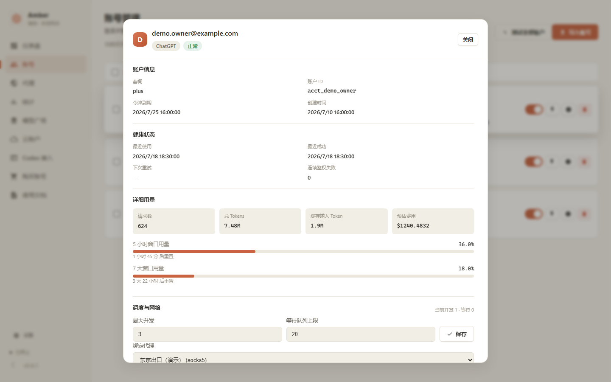
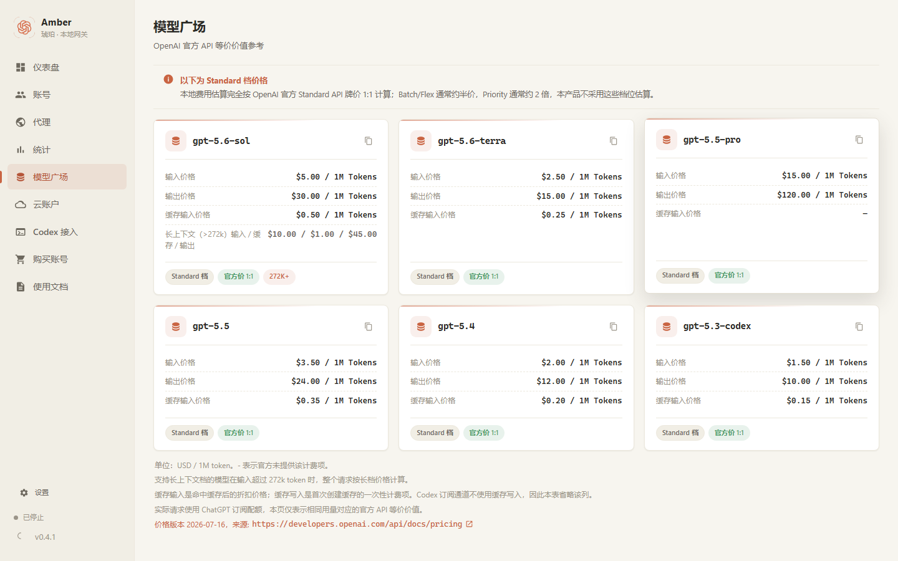
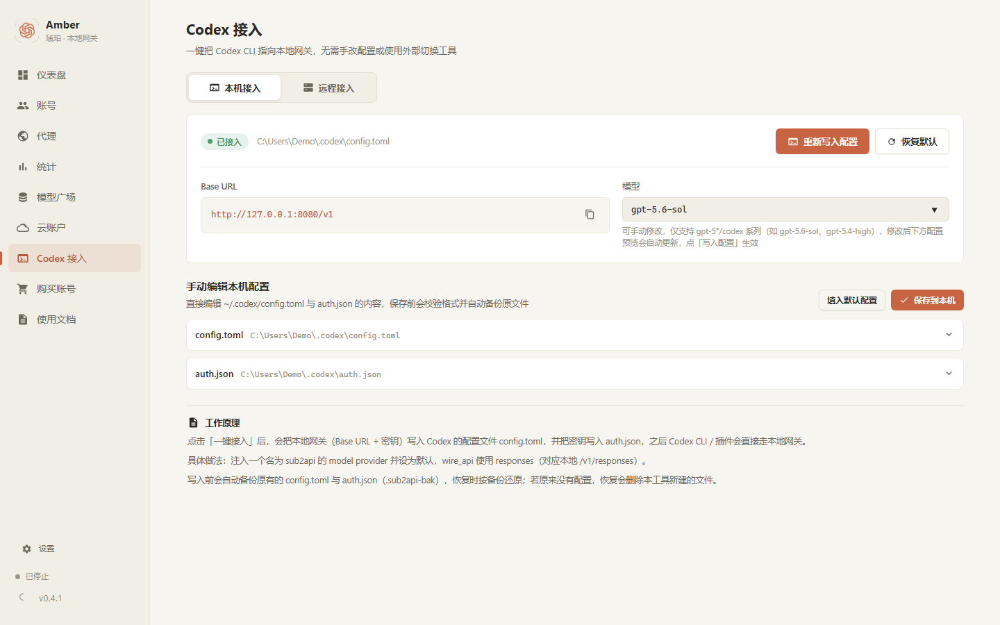
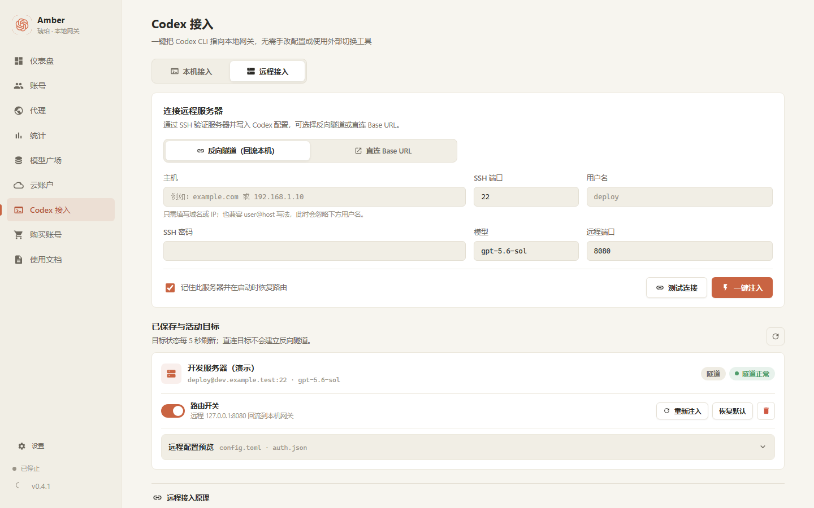
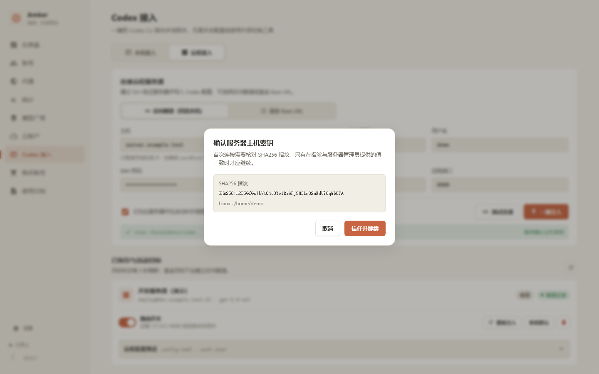
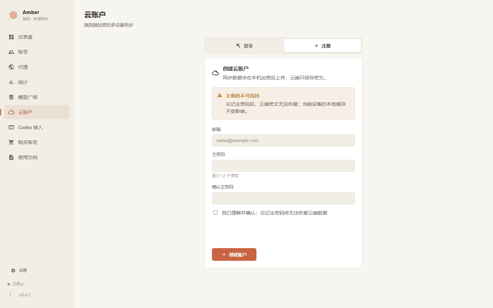
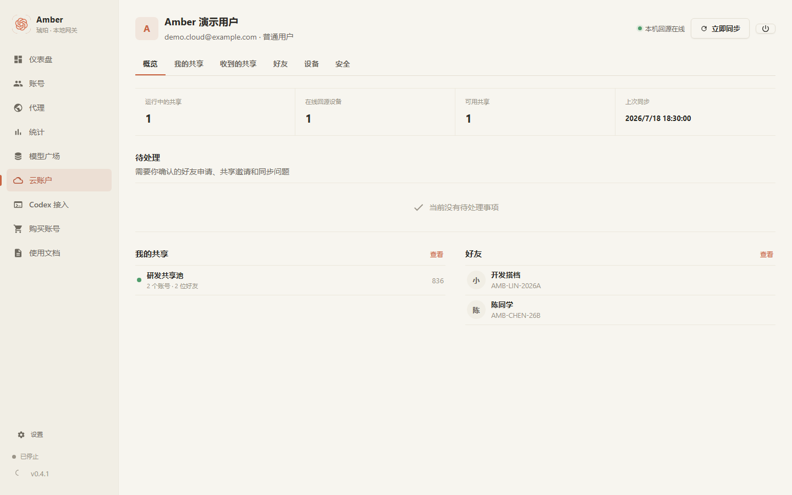

# Amber v0.4.1 使用手册

> 从账号导入、本地 API 接入，到云同步、好友和多账号共享的完整说明。

本手册中的账号、域名、Friend Code 和密钥均为演示数据，不包含真实用户信息。点击下面任一章节标题即可展开图文步骤。

## 先看这里

第一次使用只需完成这条路径：

**导入账号 → 按需配置代理 → 启动本地服务 → 一键注入或复制配置 → 在客户端验证**

| 你要完成的事情 | 去哪里 |
|---|---|
| 添加 ChatGPT 或 OpenAI 兼容账号 | 账号 → 导入账号 |
| 配置 HTTP / HTTPS / SOCKS5 | 代理 |
| 启动服务并复制连接信息 | 仪表盘 |
| 查看可用模型和价格 | 模型广场 |
| 查看 Token、费用和错误日志 | 统计 |
| 配置本机或远程 Codex | Codex 接入 |
| 同步、好友和共享组 | 云账户 |
| 修改模型、日志和数据目录 | 设置 |

---

<a id="quick-start"></a>
<details open>
<summary><strong>01 · 第一次启动与最短使用路径</strong></summary>

### 1. 确认 Amber 后台正常

打开 Amber 后，左下角状态应显示“已就绪”。如果显示“启动失败”或长期停留在启动中：

1. 打开左下角“设置”。
2. 展开“运行诊断”。
3. 根据失败阶段检查端口、数据目录或 Sidecar。

不要通过反复卸载来代替诊断。卸载或覆盖安装前应先备份数据目录。

### 2. 完成最短路径

1. 进入“账号”，导入至少一个可用账号。
2. 如需代理，先进入“代理”添加并测试代理。
3. 回到“仪表盘”，启动服务。
4. 复制 Base URL 和本地 API Key。
5. 在客户端选择 OpenAI 兼容服务，填入这两个值。

[](../src/assets/docs/dashboard.png)

> 默认 Base URL 是 `http://127.0.0.1:8080/v1`。本地 API Key 形如 `sk-local-...`，它不是 OpenAI 官方 API Key。

</details>

<a id="import-accounts"></a>
<details>
<summary><strong>02 · 导入账号：Base URL、ChatGPT OAuth 与 JSON</strong></summary>

进入“账号”，点击右上角“导入账号”。所有导入方式集中在同一个弹窗中。

[](../src/assets/docs/accounts.png)

[](../src/assets/docs/import.png)

### Base URL + API Key

适合 OpenAI 兼容上游：

- Base URL 填完整 API 地址，通常以 `/v1` 结尾。
- API Key 填上游服务提供的密钥。
- 名称用于账号列表识别，建议填写服务商或用途。
- 可在提交前选择已保存代理或明确选择直连。

导入后点击账号行的闪电按钮测试。测试错误会限制在界面容器内，可复制后排查。

### ChatGPT 授权登录

1. 选择“ChatGPT 授权登录”。
2. 如需要，先选择 OAuth 请求使用的代理。
3. 点击继续，在浏览器中完成 ChatGPT 登录与授权。
4. 返回 Amber 等待账号自动写入。

授权窗口超时或出现 `The session has expired.` 时，重新发起授权，不要重复导入旧的过期 Token。

### JSON 文件

支持以下输入：

- 单个 JSON 文件只包含一个账号。
- 单个 JSON 文件包含账号数组。
- `{ "accounts": [ ... ] }` 对象。
- 一次选择多个 JSON 文件，合并为一个批次预览。

每条 OAuth 账号至少应包含 `access_token` 或 `refresh_token`。如果有 `id_token`，Amber 会尝试解析邮箱、账号 ID 和套餐。

点击“预览”后检查：

- **新增**：创建新账号。
- **更新**：匹配到现有账号并刷新凭据。
- **跳过**：内容无需变更。
- **冲突/错误**：需先修正再提交。

> 不要把包含真实 Token 的 JSON 上传到聊天、工单、截图或公开 Git 仓库。

</details>

<a id="manage-accounts"></a>
<details>
<summary><strong>03 · 账号管理、并发队列、分页与批处理</strong></summary>

### 账号行怎么看

每个账号占一行，显示：

- 身份与账号类型。
- 健康状态和最近成功时间。
- 当前并发 / 最大并发，以及排队数量 / 队列容量。
- OAuth 额度窗口。
- 累计 Token 和预估费用。

右侧操作：

| 控件 | 作用 |
|---|---|
| 开关 | 开启或停止该账号参与调度 |
| 闪电按钮 | 测试单个账号 |
| 信息按钮 | 打开账号详情 |
| 垃圾桶 | 删除账号 |

### 最大并发与队列容量

[](../src/assets/docs/account-details.png)

- **最大并发**：该账号同时处理的请求上限。
- **队列容量**：并发已满后允许等待的请求数量。
- 队列也满时，新请求会立即被拒绝，而不是无限等待。

严重认证错误可能自动停用账号。修复凭据后，先测试成功，再重新打开调用开关。

### 批量测试与删除

1. 勾选要操作的账号。
2. 使用批量工具栏选择“测试所选”或“删除所选”。
3. 批量测试可以查看成功、失败、取消和跳过结果。
4. 批量删除不可恢复，确认前核对数量。

账号每页最多 20 个。全选只选择当前页，跨页已选择账号会保留，工具栏显示总选择数量。

</details>

<a id="proxies"></a>
<details>
<summary><strong>04 · 代理配置、批量应用与连通性测试</strong></summary>

[](../src/assets/docs/proxies.png)

### 添加代理

支持 HTTP、HTTPS 和 SOCKS5：

1. 点击“添加代理”。
2. 填写名称、类型、主机、端口以及可选用户名和密码。
3. 保存后点击“测试”。
4. 查看 DNS、连接、TLS 和 HTTP 阶段结果。

修改代理时密码可以留空复用已保存值；只有明确选择清除密码才会删除旧密码。

### 一键应用到全部账号

页面顶部工具栏可以：

- 把选定代理应用到全部现有账号。
- 清除全部账号的代理绑定。
- 启动全部账号可达性测试。

批量应用完成后 Amber 会重新读取绑定摘要进行核对。若校验失败，界面会明确提示，不会仅凭按钮请求成功就显示完成。

> “应用到全部账号”是一次性批量写入，不是永久全局规则。以后新导入的账号仍需在导入流程中选择代理。

</details>

<a id="client-setup"></a>
<details>
<summary><strong>05 · 启动本地 API 并接入客户端</strong></summary>

### 获取连接信息

在仪表盘确认服务正在运行，然后复制：

- **Base URL**：默认 `http://127.0.0.1:8080/v1`
- **API Key**：仪表盘显示的本地密钥

在 Cherry Studio、Cursor、ChatBox 等客户端中选择 **OpenAI 兼容** 服务。

某些客户端会自动追加 `/v1`。保存后如果地址变成 `/v1/v1`，请删除其中一个 `/v1`。

### 先检查模型列表

```bash
curl http://127.0.0.1:8080/v1/models \
  -H "Authorization: Bearer sk-local-替换为你的密钥"
```

能返回模型列表后，再发起最小对话请求：

```bash
curl http://127.0.0.1:8080/v1/chat/completions \
  -H "Authorization: Bearer sk-local-替换为你的密钥" \
  -H "Content-Type: application/json" \
  -d '{"model":"gpt-5.6-sol","messages":[{"role":"user","content":"ping"}]}'
```

### 局域网访问

只有需要同一局域网内其他设备访问时才打开“允许局域网访问”。打开后：

- 使用仪表盘显示的局域网地址。
- 使用 Windows 防火墙限制可信网段。
- 立即重新生成曾经泄露的本地 API Key。
- 不要把该端口直接映射到公网。

</details>

<a id="models"></a>
<details>
<summary><strong>06 · 模型广场与价格说明</strong></summary>

[](../src/assets/docs/models.png)

模型卡片显示：

- 输入价格。
- 输出价格。
- 缓存输入价格；不适用时显示 `—`。
- 272K+ 长上下文价格档。
- Standard 档与官方价 1:1 标签。

点击卡片右上角复制按钮可取得准确模型名。价格单位为 **美元 / 1M Tokens**，页面底部显示官方来源 URL 和价格版本日期。

模型出现在目录中不代表所有账号都拥有权限。账号测试返回模型无权限时，应换用账号可用模型，而不是反复重试。

</details>

<a id="statistics"></a>
<details>
<summary><strong>07 · 统计、预估费用与请求日志</strong></summary>

[](../src/assets/docs/statistics.png)

统计页提供：

- 请求量、成功率、Token、平均延迟和预估费用。
- 按日期趋势和按模型分布。
- 失败类型汇总。
- 最近请求日志。

费用按页面显示的 Standard 官方价估算，并不是账单。金额达到 `$1,000` 后使用 K/M/B 缩写并固定保留四位小数，例如 `$3,009.9833 → $3.0100K`；鼠标悬停可以查看精确金额。

排障时建议记录：

- HTTP 状态码。
- `request_id`。
- 请求模型与实际解析模型。
- 错误类型和尝试次数。
- 发生时间。

不要在日志截图中公开邮箱、API Key、Token 或完整上游错误正文。

</details>

<a id="codex"></a>
<details>
<summary><strong>08 · Codex 一键注入：本机与远程服务器</strong></summary>

> **优先使用一键注入。** 它会生成、备份并写入 Codex 配置，避免用户手工编辑 TOML 和 JSON 时填错路径、模型或密钥。

### 本机一键注入

[](../src/assets/docs/codex-local.png)

1. 先在仪表盘启动 Amber 本地服务。
2. 进入“Codex 接入 → 本机接入”。
3. 选择模型并核对 `config.toml`、`auth.json` 预览。
4. 点击“一键注入”。
5. 显示“已应用”后，重新加载或重启 Codex。

Amber 会在写入前备份：

- `~/.codex/config.toml`
- `~/.codex/auth.json`

点击“恢复”可以还原注入前文件。恢复前应先停止正在修改配置的 Codex 进程。

### 远程服务器一键注入

[](../src/assets/docs/codex.png)

#### 什么时候选择反向隧道

如果远程服务器不能访问 ChatGPT，但安装 Amber 的电脑能够通过代理访问，应选择“反向隧道（回流本机）”：

```text
远程服务器 Codex
  → 服务器 127.0.0.1:远程端口
  → SSH 反向隧道
  → 本机 Amber
  → 本机代理和账号
  → ChatGPT
```

服务器不需要安装 VPN，也不需要主动连接电脑；请求沿电脑已经建立的 SSH 连接返回。必须保持本机 Amber、SSH 连接和目标卡片中的路由开关在线。

#### 首次连接必须确认 SSH 主机密钥

[](../src/assets/docs/codex-host-key.png)

第一次连接时，Amber 会取得远程 SSH 服务器的公钥指纹。正常流程是：

1. **点击“测试连接”。** Amber 使用填写的主机、SSH 端口、用户名和密码连接远程服务器。
2. **查看确认弹窗。** Amber 弹出“确认服务器主机密钥”，显示类似 `SHA256:xxxx` 的指纹。
3. **在可信终端核对指纹。** 通过服务器控制台查看，或向服务器管理员取得指纹。
4. **确认是哪台主机。** 这里确认的是表单中填写的远程 SSH 服务器，不是 Amber 电脑、ChatGPT 或代理服务器。
5. **在本机 Amber 点击“信任并继续”。** 这个按钮表示信任主机密钥。只有指纹完全一致时才继续；不一致时立即取消。
6. **再点击“一键注入”。** Amber 备份远端 Codex 文件、写入配置并建立反向隧道。

在服务器可信终端查看主机指纹：

```bash
for key in /etc/ssh/ssh_host_*_key.pub; do
  ssh-keygen -lf "$key" -E sha256
done
```

> **重点注意：** “等待确认主机密钥”表示 Amber 正在等待当前用户在本机确认，不是让服务器自动确认，也不需要服务器管理员在远端点击按钮。没有看到弹窗时，再次点击“测试连接”或“一键注入”，不要一直等待。

#### 一键注入失败时检查

如果测试连接已经显示 Linux 和远端 `~/.codex` 路径，但随后出现 `remote Codex configuration command failed`，说明 SSH 已连接，失败发生在远端配置文件写入阶段。使用同一个 SSH 用户执行：

```bash
whoami
printf 'HOME=%s\n' "$HOME"
ls -ld "$HOME" "$HOME/.codex" 2>/dev/null
df -h "$HOME"
mkdir -p "$HOME/.codex"
chmod 700 "$HOME/.codex"
touch "$HOME/.codex/.amber-write-test" && rm "$HOME/.codex/.amber-write-test"
```

远程服务器还需要：

- `AllowTcpForwarding yes`。
- 远程端口未被占用。
- SSH 用户可以写入自己的 `~/.codex`。
- 普通个人回流不需要 `GatewayPorts`。

### 直连 Base URL

只有远程服务器能够直接访问目标 Base URL 时才选择直连。填写 Base URL 和 API Key 后注入；已保存目标再次注入时，密码和 API Key 可以留空复用已保存值。直连模式不会建立反向隧道。

手动反向隧道备用命令：

```bash
ssh -R 8080:127.0.0.1:8080 user@远程服务器
```

</details>

<a id="cloud"></a>
<details>
<summary><strong>09 · 云账户、同步、好友和多账号共享</strong></summary>

### 注册与邮箱验证

[](../src/assets/docs/cloud-register.png)

1. 切换到“注册”。
2. 填写邮箱、主密码和确认主密码。
3. 勾选主密码无法找回的确认项。
4. 完成人机验证并创建账号。
5. 输入邮件中的 6 位验证码。

主密码用于本地加密和云端密文，不提供找回。请使用密码管理器离线保存。

### 云工作台

[](../src/assets/docs/cloud-workspace.png)

登录后包含：

- **概览**：共享、在线设备、收到的共享和同步状态。
- **我的共享**：创建和管理共享组。
- **收到的共享**：接收 Base URL 和独立 API Key。
- **好友**：通过 Friend Code 建立授权关系，不提供聊天。
- **设备**：管理本机回源 Agent 和 Relay 状态。
- **安全**：查看同步、冲突和身份密钥状态。

### 创建多账号共享组

1. 进入“我的共享”，点击“新建共享”。
2. 填写共享名称和说明。
3. 选择一个或多个账号。
4. 选择一个或多个好友。
5. 设置 RPM、并发、请求额度和有效期。
6. 确认后创建。

每个接收好友拥有独立密钥。共享发起者可以暂停、恢复、限流、修改额度、轮换密钥或撤销。

OAuth 账号通过拥有者设备回源，拥有者的 Amber Agent 必须在线。API Key 账号只有在共享组明确选择 Worker 直连模式时才由 Worker 访问上游。

### 同步失败

出现 DNS、连接、TLS 或超时错误时：

1. 点击“连接设置”。
2. 在系统代理、Amber 已保存代理和直连中选择。
3. 运行网络探测。
4. 探测成功后应用并重试同步。

不要通过退出登录来掩盖网络错误；这会清除会话，但不会修复连接链路。

</details>

<a id="settings"></a>
<details>
<summary><strong>10 · 设置、数据目录与常见故障</strong></summary>

[](../src/assets/docs/settings.png)

### 常用设置

| 设置 | 说明 |
|---|---|
| 默认模型 | 客户端模型无法直接匹配时使用的回退模型 |
| Codex 模型 | 本机或远程 Codex 注入使用的模型 |
| 账号策略 | 建议使用额度感知；综合状态、额度、并发和最近使用 |
| 自动恢复 | 临时限流或网络错误后自动重新加入调度 |
| 日志保留 | 控制保留天数和最大行数 |
| 自动启动服务 | Amber 启动后自动运行本地 API |
| 语言 | 中文 / English |

### 数据目录

数据目录包含账号、代理、日志、设置和加密材料。移动前：

1. 停止高频客户端请求。
2. 保留完整备份。
3. 使用 Amber 内置迁移，不要手工复制正在使用的数据库。
4. 迁移完成后运行诊断。

### 常见故障速查

| 现象 | 优先检查 |
|---|---|
| `The session has expired.` | 重新登录云账户或重新发起 OAuth |
| 客户端 401 | 是否使用最新本地 API Key |
| 连接被拒绝 | 服务是否启动、端口是否一致、是否重复 `/v1` |
| 账号自动停用 | 详情中的状态原因；修复后先测试再开启 |
| 代理测试成功但账号失败 | 凭据、模型权限和上游响应 |
| 云同步失败 | 登录状态、Worker 地址、网络探测和待同步数据大小 |
| 页面空白 | WebView2、后台状态和内置诊断报告 |

</details>

---

## 安全说明

- Amber 的本地 API Key、上游 API Key、OAuth Token、云主密码和管理员密钥都属于敏感凭据。
- 截图前应隐藏邮箱、账号 ID、Base URL、Key、Token、服务器地址和日志正文。
- 使用非官方转发可能触发上游账号限制。代理、TLS profile 或兼容配置均不能保证账号安全。
- 请遵守相关服务条款，不要把 Amber 用于未经授权的共享或公开转售。

## 截图维护

文档截图由本地模拟数据生成，不读取真实账号。开发者可在 Amber 前端预览服务运行于 `127.0.0.1:4173` 时执行：

```powershell
C:\Users\Astin\.cache\codex-runtimes\codex-primary-runtime\dependencies\node\bin\node.exe scripts\capture-docs.mjs
```

脚本会覆盖 `src/assets/docs/` 中的文档截图。提交前必须逐张检查文字、遮挡、敏感信息和版本号。
